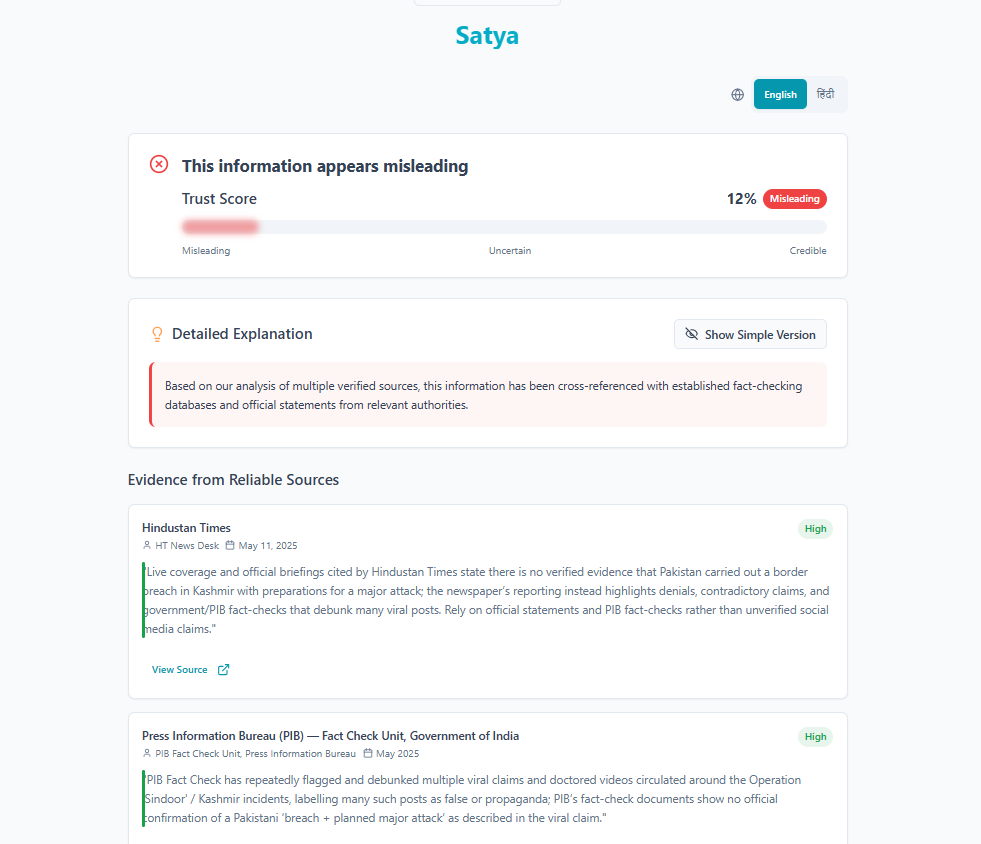

# Satya – AI-Powered Misinformation Detection

## 📌 Project Info
*Goal:* Empower Indian youth to identify and combat misinformation using an AI-powered, easy-to-use platform.

*Live Demo (Prototype):* 



 
*GitHub Repository:* [Your GitHub Repo Link]

---

## 🚀 Features
- *Home Dashboard* → Paste news links or text and check credibility.  
- *Analysis / Result* → Credibility score, plain-language verdict, and evidence snippets from trusted sources.  
- *Recommendations / Insights* → Tips on spotting misinformation and sharing verified info.  
- *Community / Support (Optional)* → Connect with experts or awareness groups.  

---

## 🛠 Tech Stack
- *Backend:* FastAPI (Python)  
- *AI Integration:* Gemini API + ADK + Grounding in trusted sources  
- *Frontend:* HTML + CSS (Jinja2 templates for prototype)  
- *Database (Optional):* MongoDB / Firebase  
- *Deployment:* Cloud Run / Docker  

---

## 💻 Installation & Setup
Clone the repo and run locally:

```bash
# Step 1: Clone the repository
git clone <YOUR_REPO_URL>

# Step 2: Navigate to the project directory
cd satya

# Step 3: Install dependencies
pip install -r requirements.txt

# Step 4: Start the development server
uvicorn app.main:app --reload